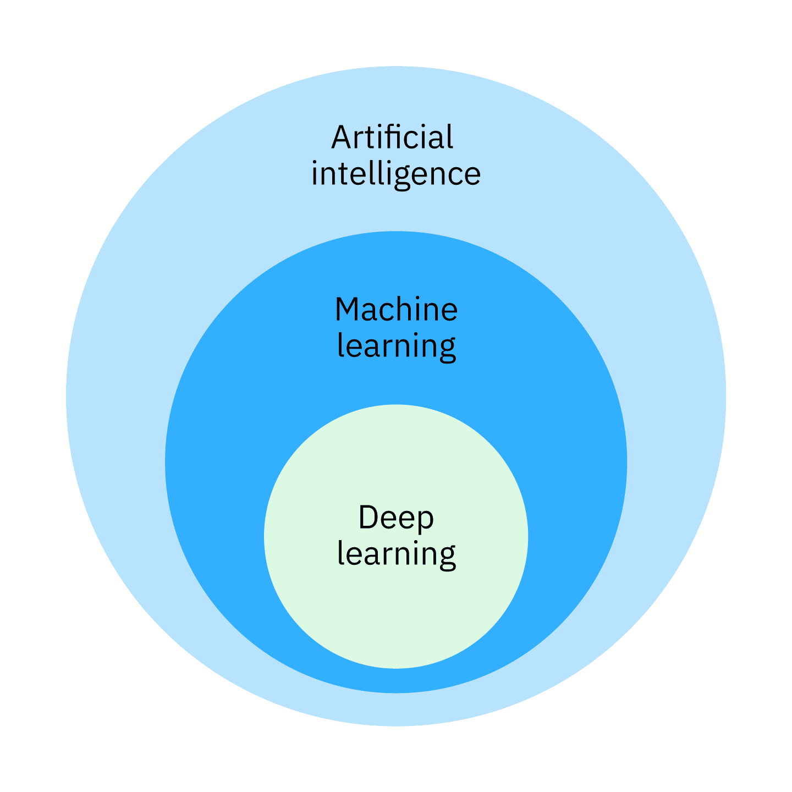
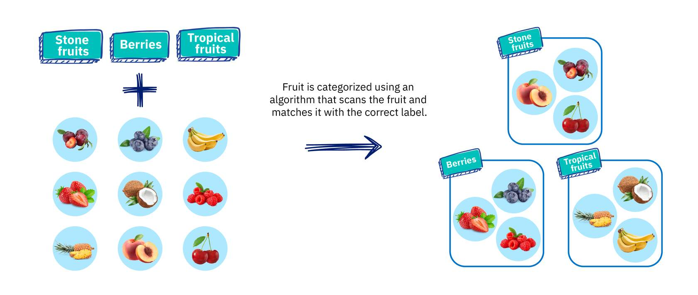
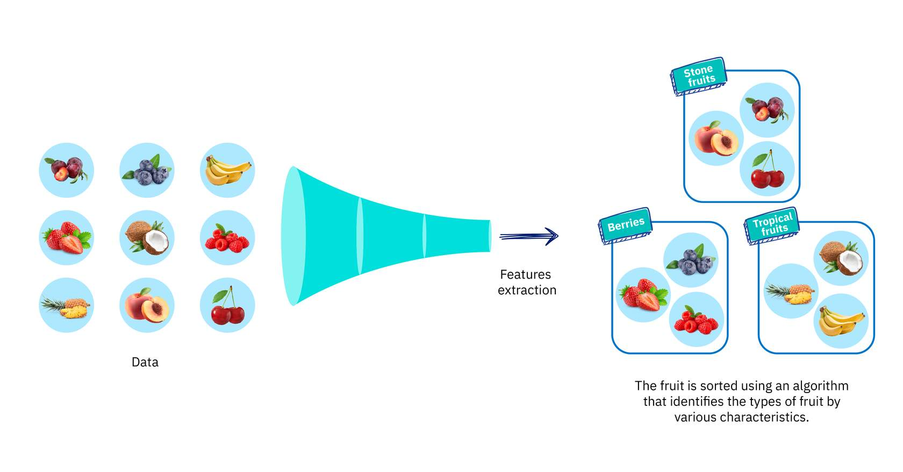

Link Sumber: [What does AI do?](https://alm.ibm.com/ibm-skillsbuildadult/trainingId/course:4058918/trainingInstanceId/course:4058918_4630713/en-US)

---
```ad-summary

```

# What does AI do?

Mesin kecerdasan buatan (para peneliti menyebutnya “layanan AI”) **tidak berpikir**. Mereka **menghitung**. Mereka adalah mesin perhitungan terbaru dan paling canggih dalam sejarah manusia.  

Beberapa di antaranya dapat melakukan apa yang disebut _machine learning_ ketika mereka menerima data baru.  

Yang lain, menggunakan perhitungan yang disusun dengan cara yang terinspirasi oleh neuron di otak manusia, bahkan dapat melakukan _deep learning_ dengan banyak tingkat perhitungan.


Bayangkan kamu diberi tugas untuk menyortir barang-barang di bagian produk segar di sebuah toko kelontong. Kamu sadar bahwa ada puluhan produk dan sangat sedikit waktu untuk menyortir semuanya secara manual.  

Bagaimana kamu bisa menggunakan kecerdasan buatan, _machine learning_, dan _deep learning_ untuk membantumu bekerja?

## Berbagai cara bekerja dengan AI
### Artificial Intelligence

Untuk memisahkan buah berbiji keras (_stone fruits_), beri, dan buah tropis, kamu bisa membuat aturan terprogram dalam bentuk _if-else statements_.  

Ini memungkinkan mesin mengenali apa yang tertulis pada label dan mengarahkan barang ke keranjang yang sesuai.

Contoh aturan terprogram mungkin seperti ini:

```
if berries_is_on_label:
    route_items_to_center_basket()

else:
    redirect_item_to_main_basket()
```

Kecerdasan buatan membuat proses ini menjadi jauh lebih efisien.



### Machine Learning

Untuk meningkatkan kinerja mesin, kamu memberi mesin lebih banyak data agar ia terlatih pada berbagai karakteristik dari tiap jenis buah. Semakin banyak data yang kamu berikan kepada algoritma, semakin baik modelnya. Dengan memberikan lebih banyak data dan menyesuaikan parameter, mesin meminimalkan kesalahan melalui proses menebak berulang-ulang.



### Deep Learning

Toko kelontong kini memperluas pilihan produk segarnya untuk mencakup lebih banyak variasi seperti nektarin dan plum (_stone fruits_), blackberry dan cranberry (_berries_), serta mangga dan belimbing (_tropical fruits_). Selain itu, produk-produk ini sekarang hadir dalam berbagai ukuran, bentuk, dan warna. Apa yang membuat _deep learning_ berbeda?

Model _deep learning_ menghilangkan kebutuhan untuk melakukan _feature extraction_ secara manual. Untuk pekerjaanmu di bagian produk segar, kamu memutuskan untuk menggunakan algoritma berbasis _deep learning_ untuk menyortir buah—tanpa perlu lagi mendefinisikan ciri-ciri setiap buah secara manual. _Feature extraction_ sudah menjadi bagian dari proses, tanpa campur tangan manusia. Setelah kamu memberikan puluhan gambar buah kepada model _deep learning_, model tersebut memproses gambar-gambar itu melalui berbagai lapisan _neural network_. Lapisan-lapisan ini kemudian dapat mempelajari representasi implisit dari data mentah tersebut secara mandiri.

## Kalkulasi AI

Bagaimana layanan AI melakukan perhitungan? Dan apa yang mereka lakukan dengan hasil perhitungan tersebut? Mari kita bagi penjelasannya menjadi dua bagian.
### Analysis

Layanan AI dapat menerima (atau “mengambil masuk”) sejumlah besar data. Mereka bisa menerapkan perhitungan matematis untuk menganalisis data, lalu menyortir dan mengorganisasikannya dengan cara yang beberapa tahun lalu saja masih dianggap mustahil.

### Prediction

Layanan AI dapat menggunakan analisis data mereka untuk membuat prediksi. Secara sederhana, mereka bisa “mengatakan”, _“Berdasarkan informasi ini, kemungkinan besar sesuatu akan terjadi.”_

---

Inilah yang dilakukan layanan AI! Berdasarkan analisis data, mereka membuat prediksi.  
Kelihatannya sepele, tapi analisis dan prediksi itu bisa memberi dampak yang sangat besar pada kehidupan manusia.

Sebelum lanjut, luangkan waktu sebentar untuk membandingkan “analisis” dan “prediksi” dengan tebakan yang kamu buat sebelumnya. Terkejut?  

Kalau iya, mungkin kamu mulai bertanya-tanya bagaimana dua tindakan yang tampaknya sederhana itu bisa begitu penting.
