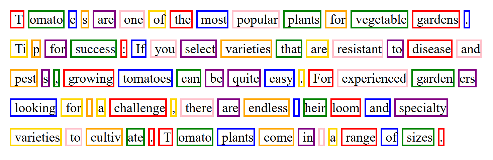

Link Sumber: [Tokenization](https://alm.ibm.com/ibm-skillsbuildadult/trainingId/course:4058859/trainingInstanceId/course:4058859_4630654/en-US)

---
```ad-summary

```

# Tokenization

**Tokenisasi** adalah fase krusial dalam penyetelan halus (_fine-tuning_) LLM. Tokenisasi adalah proses memecah dokumen teks atau urutan kata menjadi unit yang lebih kecil yang disebut **token**. Token bisa sesingkat karakter individual, kata, atau bahkan sub-kata. Tokenisasi membantu dalam berbagai tugas terkait bahasa, seperti klasifikasi teks dan analisis sentimen. Dalam domain ilmiah atau teknis, tokenisasi khusus mungkin diperlukan untuk memecah istilah-istilah kompleks. Tokenisasi adalah langkah fundamental dalam pemrosesan bahasa alami (NLP) karena ia mengubah data teks menjadi format yang dapat dipahami oleh model _machine learning_.

**Batas token (_token limits_)** adalah pembatasan jumlah token yang dapat diproses oleh LLM dalam satu interaksi. Token adalah potongan kecil teks yang digunakan untuk mewakili potongan teks yang lebih besar; misalnya, '_Machines are interesting!_' terdiri dari token berikut: '_Ma_', '_chine_' '_s_', '_are_', '_inter_', '_est_', '_ing_', '_!_'. Batasan token adalah faktor signifikan dalam LLM karena dapat memengaruhi kemampuan model untuk menghasilkan _output_ yang diinginkan. Jika Anda menyetel batas terlalu rendah, model tidak akan menghasilkan cukup token dan mungkin tidak dapat menyelesaikan tugasnya. Sebagai contoh, jika Anda berniat membuat dokumen berisi 2500 kata tetapi menyetel batas token pada 2500, maka model hanya akan menghasilkan 2500 token pertama. Namun, batas token yang terlalu tinggi dapat memperlambat model atau menuntut sumber daya komputasi yang besar.

Gambar berikut menunjukkan bagaimana contoh input ini mungkin ditokenisasi:

Tomatoes are one of the most popular plants for vegetable gardens. Tip for success: If you select varieties that are resistant to disease and pests, growing tomatoes can be quite easy. For experienced gardeners looking for a challenge, there are endless heirloom and specialty varieties to culti1vate. Tomato plants come in a range of2 sizes.



Apakah Anda memperhatikan bahwa beberapa kata dipecah menjadi beberapa token dan beberapa lainnya tidak - seperti contoh pertama dari kata _tomatoes_ dan kata _pests_. Salah satu alasan tokenisasi bisa menjadi rumit adalah karena setiap model memiliki jenis _tokenizer_-nya sendiri. Tokenisasi memainkan peran krusial dalam tugas pemrosesan bahasa alami, dan pilihan aturan tokenisasi dapat memengaruhi hasil. Model yang dilatih sebelumnya (_pretrained models_) dilatih pada data yang ditokenisasi, jadi saat menggunakannya, penting untuk menokenisasi input menggunakan aturan yang sama dengan yang digunakan selama pelatihan untuk memastikan fungsi yang tepat. Ini memastikan bahwa model yang dilatih sebelumnya dapat memahami dan memproses input secara efektif.
### Algoritma Tokenisasi

Beberapa contoh algoritma tokenisasi sub-kata adalah:

- **Byte Pair Encoding (BPE):** Membangun kosakata unit sub-kata dengan panjang bervariasi berdasarkan frekuensi kemunculannya dalam data pelatihan. Digunakan secara luas dalam tugas NLP dan digunakan pada model seperti **GPT-2** dan **RoBERTa**.
    
- **WordPiece:** Dimulai dengan karakter individual sebagai token dan secara iteratif menggabungkannya berdasarkan kemungkinan kemunculan bersama dalam data pelatihan. Digunakan oleh **BERT** dan **DistilBERT**.
    
- **SentencePiece:** Metode tokenisasi sub-kata yang lebih baru yang memperluas algoritma BPE dan WordPiece. Ia memperlakukan teks input sebagai urutan kalimat dan membaginya menjadi sejumlah potongan yang ditentukan pengguna. Populer digunakan pada model seperti **T5**.

---

Ini hanyalah beberapa contoh, dan tingkat kerincian (_granularity_) tokenisasi yang diinginkan dapat bervariasi tergantung pada tugas spesifik dan bahasa yang sedang diproses. Apakah Anda bertanya-tanya mengapa simbol **##** disertakan dalam _output_? Itu karena tokenisasi memecah kata menjadi unit sub-kata dan merepresentasikannya dengan awalan "**##**" untuk menunjukkan bahwa bagian tersebut adalah bagian dari kata yang lebih besar. Bentuk tokenisasi ini membantu dalam menangani kata-kata di luar kosakata (_out-of-vocabulary_) dan meningkatkan performa model.

Tujuannya adalah untuk merepresentasikan kosakata bahasa secara efisien dengan jumlah token yang dapat dikelola. Tokenisasi menyederhanakan teks untuk diproses, memungkinkan LLM untuk menganalisis, memahami, dan menghasilkan teks secara lebih efektif. Pilihan metode tokenisasi bergantung pada arsitektur LLM yang spesifik dan persyaratan tugas.

---
Tokenisasi adalah langkah penting karena model AI tidak bisa membaca teks seperti manusia; mereka hanya memahami angka. Tokenisasi mengubah kata-kata menjadi unit data (token) yang bisa diproses oleh mesin secara efisien.

Berikut adalah beberapa alasan pentingnya dan tantangan yang muncul:

**Mengapa Penting:**

- **Pemahaman Mesin:** Mengonversi teks menjadi format numerik yang dapat diolah algoritma.
    
- **Konteks & Makna:** Membantu model memahami hubungan antar kata dan struktur kalimat.
    
- **Efisiensi Kosakata:** Menggunakan sub-kata (seperti sistem `##`) memungkinkan model menangani kata-kata yang jarang atau baru tanpa membutuhkan memori yang sangat besar.
    

**Tantangan yang Muncul:**

- **Ambuitas:** Kata yang sama bisa punya arti beda tergantung cara memotongnya.
    
- **Bahasa yang Berbeda:** Aturan pemotongan kata di bahasa Inggris berbeda dengan bahasa lain yang tidak menggunakan spasi (seperti Mandarin).
    
- **Istilah Teknis:** Kata-kata sains atau medis yang rumit seringkali sulit dipecah secara akurat oleh _tokenizer_ standar.
    
- **Batas Token:** Jika tokenisasi menghasilkan terlalu banyak unit, teks bisa terpotong karena melebihi kapasitas memori model.


---

**Tokenisasi diperlukan untuk memecah teks menjadi unit-unit yang lebih kecil atau token.**

Beberapa tantangan potensial yang dapat muncul selama proses tokenisasi meliputi:

- **Penanganan tanda baca:** Menentukan apakah tanda baca harus dianggap sebagai token terpisah atau bagian dari kata (misalnya, tanda titik di akhir kalimat versus tanda titik pada singkatan seperti "A.I.").
    
- **Karakter khusus:** Mengelola simbol, emoji, atau karakter non-standar yang mungkin memiliki makna penting dalam konteks tertentu.
    
- **Bahasa dengan sistem penulisan unik:** Menangani bahasa yang tidak menggunakan spasi antar kata (seperti bahasa Mandarin atau Jepang) atau bahasa yang sangat bergantung pada perubahan bentuk kata (seperti bahasa Jerman atau Turki).
    