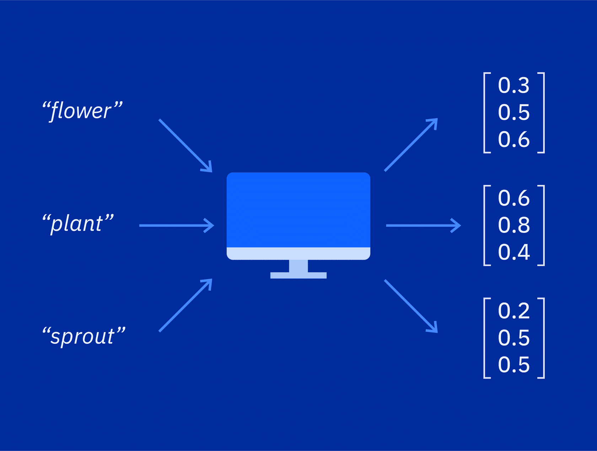
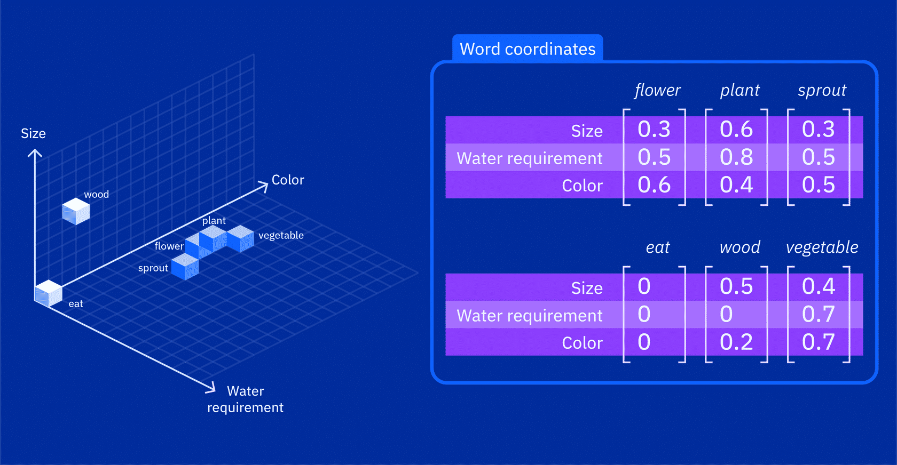
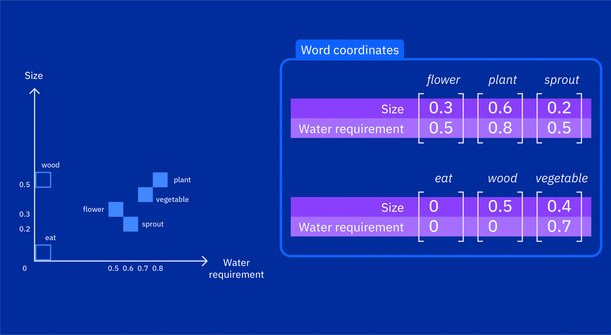

Link Sumber: [Embeddings](https://alm.ibm.com/ibm-skillsbuildadult/trainingId/course:4058859/trainingInstanceId/course:4058859_4630654/en-US)

---
```ad-summary

```

# Embeddings

Dalam dunia LLM, **embeddings** memainkan peran krusial dalam merepresentasikan makna kata dan konteks di mana kata tersebut digunakan. LLM menggunakan _embeddings_ untuk mengubah kata menjadi **vektor** yang dapat diproses dan dimanipulasi di dalam model, menangkap nuansa bahasa dan asosiasinya.

Sebuah **embedding** adalah representasi matematis dari sebuah kata atau urutan kata dalam ruang vektor numerik.



Dalam bentuknya yang paling dasar, _embedding_ hanyalah sebuah cara untuk merepresentasikan kata-kata menggunakan angka. Bayangkan Anda memiliki daftar kata seperti "bunga" (_flower_), "tanaman" (_plant_), dan "tunas" (_sprout_). Alih-alih hanya menggunakan kata-kata itu sendiri, _embeddings_ membuat representasi numerik untuk kata-kata tersebut. _Embeddings_ ini bisa berupa bilangan bulat (_integers_), bilangan desimal (_floats_), atau nilai numerik lainnya.

Ketika _embeddings_ ini digunakan sebagai input untuk operasi matematika atau model tertentu, seperti fungsi **Softmax**, mereka diubah menjadi probabilitas. Sebelum transformasi Softmax, _embeddings_ mungkin merepresentasikan skor mentah atau nilai yang belum dinormalisasi yang terkait dengan berbagai kelas atau kategori. Fungsi Softmax mengambil sebuah vektor angka sebagai input dan menghasilkan vektor lain dengan dimensi yang sama sebagai output. Setiap elemen dalam vektor output adalah nilai probabilitas antara 0 dan 1.

Fungsi Softmax bekerja dengan menormalisasi nilai input, yang berarti meningkatkan ukuran relatifnya satu sama lain dan juga memastikan bahwa jumlah totalnya sama dengan 1. Normalisasi ini membuat nilai input cocok digunakan sebagai distribusi probabilitas. Sebagai contoh, jika vektor input merepresentasikan skor dari sekumpulan opsi, fungsi Softmax dapat digunakan untuk mengubah skor tersebut menjadi nilai probabilitas. Opsi dengan skor tertinggi akan memiliki nilai probabilitas tertinggi dalam vektor output, sementara sisanya akan memiliki nilai probabilitas yang lebih rendah, didistribusikan secara proporsional berdasarkan skor aslinya. Vektor output yang dihasilkan oleh fungsi Softmax dapat digunakan dalam berbagai aplikasi, seperti pada model yang mengklasifikasikan data input ke dalam kategori yang berbeda. Dengan menghasilkan probabilitas yang mewakili kemungkinan setiap kategori, fungsi Softmax membantu menentukan kategori mana yang dimiliki oleh data input tersebut.

Mesin pada dasarnya memahami data numerik, jadi dengan merepresentasikan kata-kata sebagai _numerical embeddings_, model _machine learning_ dapat menggunakan representasi ini untuk memproses dan menganalisis bahasa. Hal ini memungkinkan model untuk melakukan komputasi dan memahami kata-kata, yang pada akhirnya memungkinkan mereka menghasilkan bahasa yang menyerupai manusia.

Mari kita pelajari contoh yang lebih mendetail tentang kegunaan _embedding_. Perhatikan tabel berikut, yang menunjukkan perbandingan fitur dari 'bunga', 'tanaman', dan 'tunas'. Fitur-fitur tersebut adalah berbagai karakteristik atau atribut yang terkait dengan setiap kata.

Dalam tabel ini, angka atau nilai untuk setiap fitur berkisar dari 0 hingga 1.

- **Size (Ukuran):** Merepresentasikan ukuran fisik, di mana 0 menunjukkan ukuran kecil dan 1 menunjukkan ukuran besar.
- **Water requirement (Kebutuhan air):** Menunjukkan jumlah air yang dibutuhkan, di mana 0 berarti rendah dan 1 berarti tinggi.
- **Color (Warna):** Merepresentasikan warna khas, di mana 0 menunjukkan warna netral/kurang mencolok dan 1 menunjukkan warna yang sangat cerah/intens.

Sekarang, mari kita perluas perbandingannya dengan menambah kata lain seperti **'eat'** (makan), **'wood'** (kayu), dan **'vegetable'** (sayur).

Tabel ini dapat diplot sebagai titik-titik pada **grafik 3 dimensi**, di mana:

- Sumbu x mewakili 'Size'
- Sumbu y mewakili 'Water requirement'
- Sumbu z mewakili 'Color'

Posisi setiap kata dapat dilihat pada grafik, dengan koordinat yang diambil dari nilai numerik fitur-fitur tersebut di dalam tabel.



Dimensi dari grafik 3D di atas dapat dikurangi menjadi **2D** agar lebih mudah dilihat. Karena tabel tersebut hanya memiliki sedikit kata, nilai **'Size'** (Ukuran) dan **'Water requirement'** (Kebutuhan air) dapat digunakan langsung sebagai parameter untuk visualisasi.

Dengan menyederhanakannya menjadi dua sumbu (X dan Y), kita bisa lebih mudah melihat bagaimana kata-kata yang memiliki karakteristik serupa akan berkumpul di area yang berdekatan. Misalnya, "tanaman" dan "sayur" mungkin akan berada di posisi yang berdekatan karena keduanya memiliki kebutuhan air dan ukuran yang mirip.



Representasi numerik ini, yang disebut sebagai **embeddings**, memiliki tujuan yang menarik. Salah satu aplikasi praktisnya adalah membandingkan seberapa mirip kata-kata tersebut.

Dalam contoh yang diberikan, kata '_flower_,' '_plant_,' '_sprout_,' dan '_vegetable_' terletak berdekatan satu sama lain dalam grafik. Posisi ini menunjukkan bahwa kata-kata tersebut berbagi makna yang serupa atau kemungkinan besar disebutkan dalam kalimat atau teks yang sama dengan konteks yang sebanding.

- **Semantic Features:** Ukuran (_Size_), Kebutuhan air (_Water requirement_), dan Warna (_Color_) disebut sebagai fitur semantik yang mewakili properti makna setiap kata.
    
- **Feature Vectors:** Daftar angka untuk setiap kata adalah **vektor**, dan karena angka tersebut menyampaikan nilai dari fitur semantik, mereka juga disebut vektor fitur.
    

Bayangkan _embeddings_ sebagai "tanda tangan" khas untuk kata-kata yang menangkap makna halus mereka. Kata dengan konteks atau makna serupa akan menunjukkan representasi vektor yang sebanding. Hal inilah yang membuat _embeddings_ sangat berharga dalam pemrosesan bahasa alami.

Berikut adalah beberapa contoh model _embedding_:

### Word Embeddings (Embedding Kata)

- **Word2Vec:** Model populer yang merepresentasikan kata sebagai vektor dalam ruang kontinu. Kata dengan makna serupa akan saling berdekatan.
    
- **GloVe (Global Vectors for Word Representation):** Mirip dengan Word2Vec, namun fokus pada informasi statistik global dari kemunculan kata secara bersamaan.
    

### Sentence Embeddings (Embedding Kalimat)

- **InferSent:** Mempelajari _embedding_ kalimat universal untuk menangkap makna semantik kalimat.
    
- **Universal Sentence Encoder (USE):** Dikembangkan oleh Google untuk menyediakan _embedding_ bagi kalimat dan paragraf pendek.
    

### Image Embeddings (Embedding Gambar)

- **ImageNet Embeddings:** Sering digunakan dalam visi komputer. _Convolutional Neural Networks_ (CNN) mempelajari representasi gambar sebagai vektor dalam ruang berdimensi tinggi untuk menangkap fitur visual penting.
    

### Document Embeddings (Embedding Dokumen)

- **Doc2Vec:** Ekstensi dari Word2Vec yang merepresentasikan seluruh dokumen sebagai vektor dengan tetap menjaga urutan kata.
    
- **BERT:** Meski awalnya untuk prediksi kata, BERT juga menghasilkan _embedding_ tingkat dokumen yang menangkap informasi kontekstual.
    

Merepresentasikan hubungan dan makna kata-kata dalam ruang matematis. Dengan menggunakan _embeddings_ ini, model-model tersebut dapat menciptakan bahasa yang jelas dan sadar konteks, sehingga berguna untuk tugas-tugas seperti memahami dan menghasilkan teks yang menyerupai manusia.

Dalam Gen-AI, _embeddings_ bertindak sebagai komponen dasar bagi model bahasa dan sistem yang menciptakan konten baru. Dengan _embeddings_, model Gen-AI mempelajari pola dan struktur data, yang memungkinkan mereka untuk menghasilkan konten segar yang sesuai dengan pola-pola tersebut.